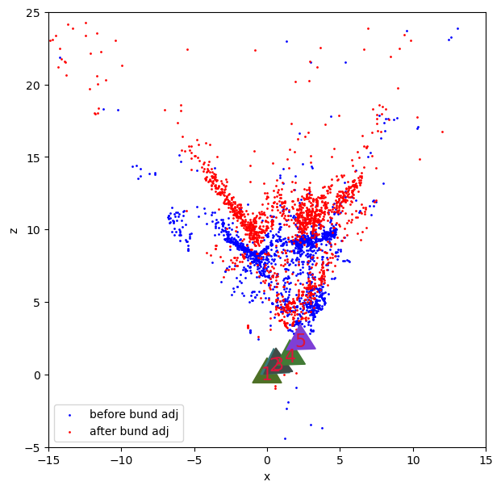

# Structure from Motion(SfM) for reconstruction of scenes from Monocular Images

This respository contains an implementation of the Struture from Motion (SfM) pipeline for reconstruction of 3D scenes from a set of monocular camera images. The project was done as part of the course- RBE 549 Computer Vision, conducted by Prof. Nitin J Sanket at the Worcester Polytechnic Institute (WPI).

## Main Features:
- Used Epipolar constraint to perform RANSAC to obtain Fundamental and Essential Matrices.
- Performed Linear and Non-Linear Triangulation to perform 2D to 3D point projection, and Linear and Non-Linear PnP to obtain camera poses.
- Implemented Bundle Adjustment to combine projected points and camera poses to obtain final 3D points and poses.

## Results

The image below shows the final camera poses and 3D Projected Points after Bundle Adjustment:

    

